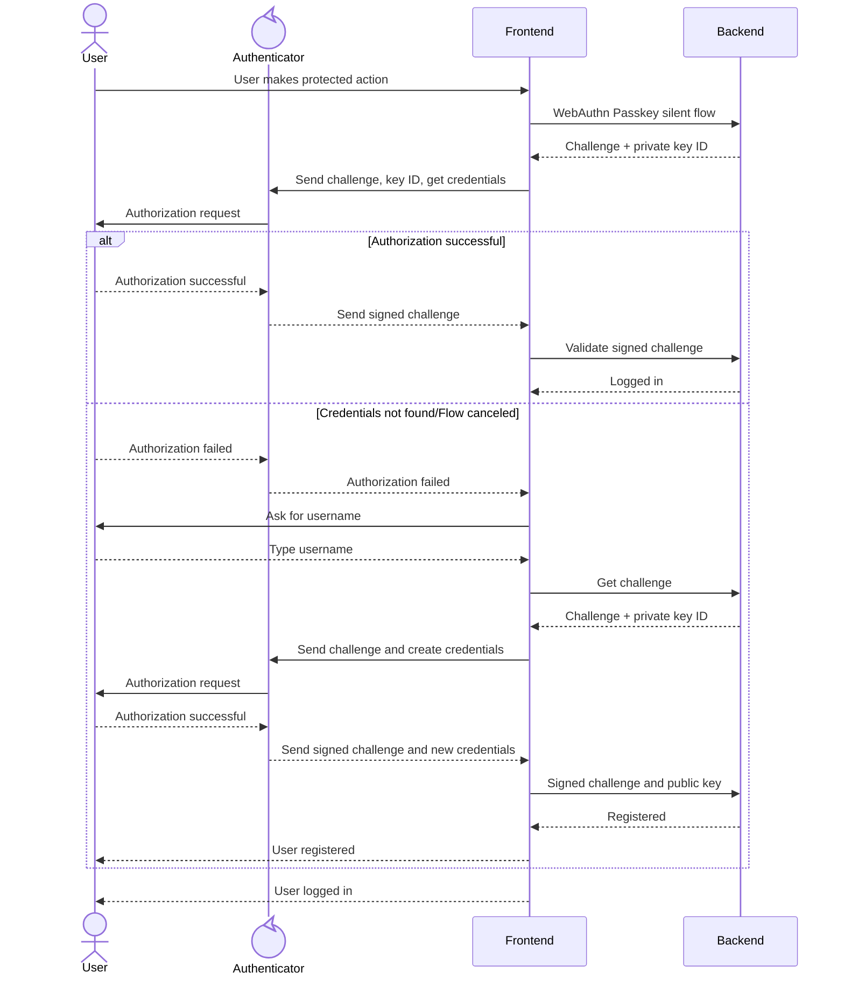

# Rent'n'Sail passwordless auth flow

```mermaid
---
Auth Flow
---
sequenceDiagram
    actor U as User
    participant Auth@{ "type": "control" } as Authenticator
    participant F as Frontend
    participant B as Backend
    
    U->>F: User makes protected action
    F->>B: WebAuthn Passkey silent flow
    B-->>F: Challenge + private key ID
    F->>Auth: Send challenge, key ID, get credentials
    Auth->>U: Authorization request
    alt Authorization successful
        U-->>Auth: Authorization successful
        Auth-->>F: Send signed challenge
        F->>B: Validate signed challenge
        B-->>F: Logged in
    else Credentials not found/Flow canceled
        U-->>Auth: Authorization failed
        Auth-->>F: Authorization failed
        F->>U: Ask for username
        U-->>F: Type username
        F->>B: Get challenge
        B-->>F: Challenge + private key ID
        F->>Auth: Send challenge and create credentials
        Auth->>U: Authorization request
        U-->>Auth: Authorization successful
        Auth-->>F: Send signed challenge and new credentials
        F->>B: Signed challenge and public key
        B-->>F: Registered
        F-->>U: User registered
    end
    F-->>U: User logged in
```